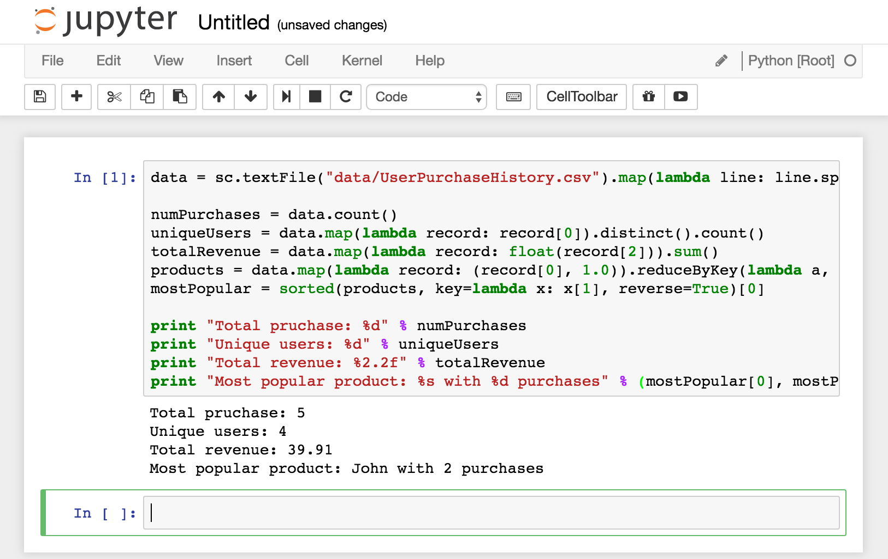
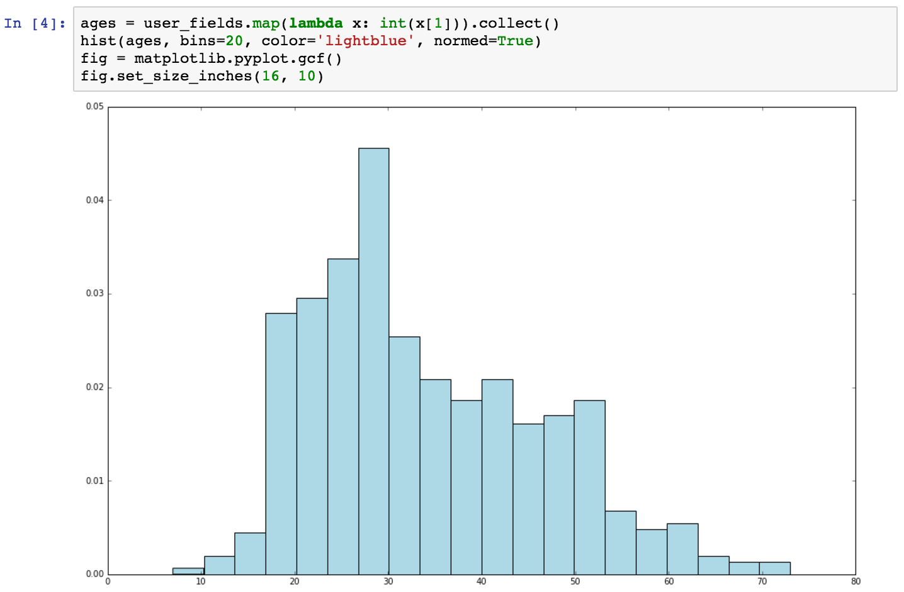

# 探索與可視化數據

參考資料
- [Machine Learning with Spark - Tackle Big Data with Powerful Spark Machine Learning Algorithms](https://www.amazon.com/Machine-Learning-Spark-Powerful-Algorithms/dp/1783288515)
- [在 Spark 中使用 IPython Notebook](http://www.cnblogs.com/NaughtyBaby/p/5469469.html)
- [ipythonnotebook + spark](http://blog.csdn.net/sadfasdgaaaasdfa/article/details/47090513)
- [Spark入门（Python版）](http://blog.jobbole.com/86232/)

## 安裝、設定

### 下載、安裝 IPython Notebook
下載預先編譯好的 python 套件 [Anacaonda](https://www.continuum.io/downloads)

```shell
$ wget http://repo.continuum.io/archive/Anaconda2-4.1.1-Linux-x86_64.sh
$ bash Anaconda2-4.1.1-Linux-x86_64.sh
```

### 設定環境
根據 [在 Spark 中使用 IPython Notebook](http://www.cnblogs.com/NaughtyBaby/p/5469469.html) 說明，修改 `~/.bashrc` 設定環境變數

```
# pyspark variables
export PYSPARK_DRIVER_PYTHON=ipython2
export PYSPARK_DRIVER_PYTHON_OPTS="notebook --ip=192.168.33.10"
```
- VM private network IP=192.168.33.10，要將 Guest OS Web service 綁定這個 IP，Host OS 的瀏覽器才能使用 IPython Notebook

```shell
$ source ~/.bashrc
```

### 啟動 PySpark with IPython Notebook
```shell
$ pyspark
```

### 牛刀小試
```shell
$ pyspark
```

- 打開瀏覽器，輸入 URL `http://192.168.33.10:8888/`
- 變更工作目錄到 `~/learn-spark/machine-learning-with-spark/src/ex-1.6`
- 開啟 IPython Notebook，`New` >> `Python[Root]`
- 貼上以下內容，執行 `Run` >> `Run Cells`

```python
data = sc.textFile("data/UserPurchaseHistory.csv").map(lambda line: line.split(",")).map(lambda record: (record[0], record[1], record[2]))

numPurchases = data.count()
uniqueUsers = data.map(lambda record: record[0]).distinct().count()
totalRevenue = data.map(lambda record: float(record[2])).sum()
products = data.map(lambda record: (record[0], 1.0)).reduceByKey(lambda a, b: a+b).collect()
mostPopular = sorted(products, key=lambda x: x[1], reverse=True)[0]

print "Total pruchase: %d" % numPurchases
print "Unique users: %d" % uniqueUsers
print "Total revenue: %2.2f" % totalRevenue
print "Most popular product: %s with %d purchases" % (mostPopular[0], mostPopular[1])
```
- 因為是 spark shell，不需要產生 sc (SparkContext)



### 停止 PySpark with IPython Notebook
- 在 terminal 按下 `q`，出現提示 `Do you want to exit w3m? (y/n)`，回答 `y`
- 然後按下 `Ctrl-C` 停止伺服器，出現提示 `Shutdown this notebook server (y/[n])?`，回答 `y`

## 透過圖形探索數據

source: [src/ex-3.2.ipynb](src/ex-3.2.ipynb)


