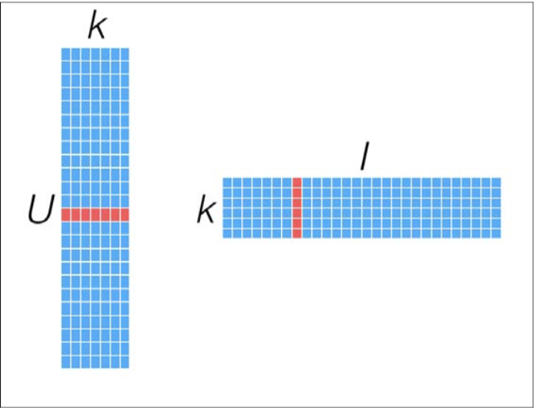

# 建構基於 Spark 的推薦引擎

## 推薦引擎

推薦引擎背後的想法是預測人們可能喜歡的物品，並通過探詢物品之間的關聯關係來輔助這個過程。
- 基於用戶的推薦：告訴用戶有「哪些電影他們可能會喜歡」
- 基於商品的推薦：告訴用戶有「哪些電影跟某一電影類似」

用戶/電影 | 電影A | 電影B | 電影C | 電影D
----------|-------|-------|-------|-------
用戶A     | V     |       | V     | V
用戶B     | V     |       | V     | 
用戶C     | V     | V     |       |

### 基於用戶的推薦
- 用戶A 看過 電影A, C, D
- 用戶B 看過 電影A, C
- 把用戶A, B 當作相似的
- 推薦電影D 給用戶A

用戶/電影 | 電影A | 電影B | 電影C | 電影D
----------|-------|-------|-------|-------
用戶A     | V     |       | V     | V
用戶B     | V     |       | V     | 推薦

如果兩個用戶表現出相似的偏好（對相同物品的偏好大致相同），就認為他們的興趣類似。要對其中一個用戶推薦一個未知物品，可選取若干與其類似的用戶，根據他們的喜好計算出各個物品的得分，再以得分推薦物品。

### 基於商品的推薦
- 用戶A 看過電影A，也看了電影C
- 用戶B 看過電影A，也看了電影C
- 推測電影A, C 有關聯性
- 用戶C 看過電影A，還沒看過電影C
- 推薦電影C 給用戶C

用戶/電影 | 電影A | 電影B | 電影C | 電影D
----------|-------|-------|-------|-------
用戶A     | V     |       | V     | V
用戶B     | V     |       | V     | 
用戶C     | V     | V     | 推薦  |

相似用戶評級相同的那些物品被認為更相近，藉此得到物品之間的相似度。使用用戶接觸過的物品表示這個用戶，然後找出那些與已知物品相似的其他物品，將這些物品推薦給用戶。

### 推薦引擎常見場景
- 偏個人喜好 - 人們根據個人喜好選擇物品。利用群體智慧，根據其他類似喜好用戶的訊息幫助用戶發現所需物品。
- 可選項眾多 - 可選項越多，用戶越難找到想要物品。通過向用戶推薦相關物品，其中有些可能用戶事先不知道，能幫助用戶發現新物品。

### 推薦模型種類
- 基於內容的過濾 (需事先定義用戶與物品的屬性，工作量大、有隱私權疑慮)
- 協同過濾
- 排名模型

## 矩陣分解 (Matrix factorization)
- 顯式矩陣 - 要處理那些數據是由用戶所提供的偏好數據，例如用戶對電影的評價
- 隱式矩陣 - 用戶對物品的偏好不會直接給出，而是隱含在用戶與物品的互動之中，例如用戶把某商品加入購物車

大部份情況下，單個用戶只會接觸少部分物品，使得該矩陣只有少部分的數據非零，這種矩陣也稱為稀疏矩陣 (sparse matrices)。對於這種矩陣的建模，採用矩陣分解方式，具體方法是找出兩個低維度的矩陣，使得他們的乘積類似原始矩陣。
- 原始矩陣: [U x I]
- 因子矩陣: [U x k], [k x I], k 小於 U, I

要計算給定用戶對於某物品的預期評價，從用戶因子矩陣和物品因子矩陣分別選曲相對應的行(用戶因子向量)與列(物品因子向量)，計算兩者的點積。

> 用戶因子向量: user's factor vector, 物品因子向量: item's factor vector

對於物品間的相似性，使用最鄰近模型中用到的相似衡量方法。利用物品因子向量，將相似度計算轉換為對兩物品因子向量之間相似度的計算。

### ALS (Alternaing Least Square)
是一種求解矩陣分解問題的優化方法。實現原理：每一次迭代，固定用戶因子矩陣或是物品因子矩陣的一個，然後用固定的這個矩陣以及評級數據來更新另一個矩陣。之後被更新的矩陣固定住，在更新另一個矩陣。迭代直到模型收斂。

## 使用用戶偏好資料來建立推薦模型
## 使用模型為用戶進行推薦、找出指定物品的類似物品
## 應用標準的評估指標來評估該模型的預測能力
